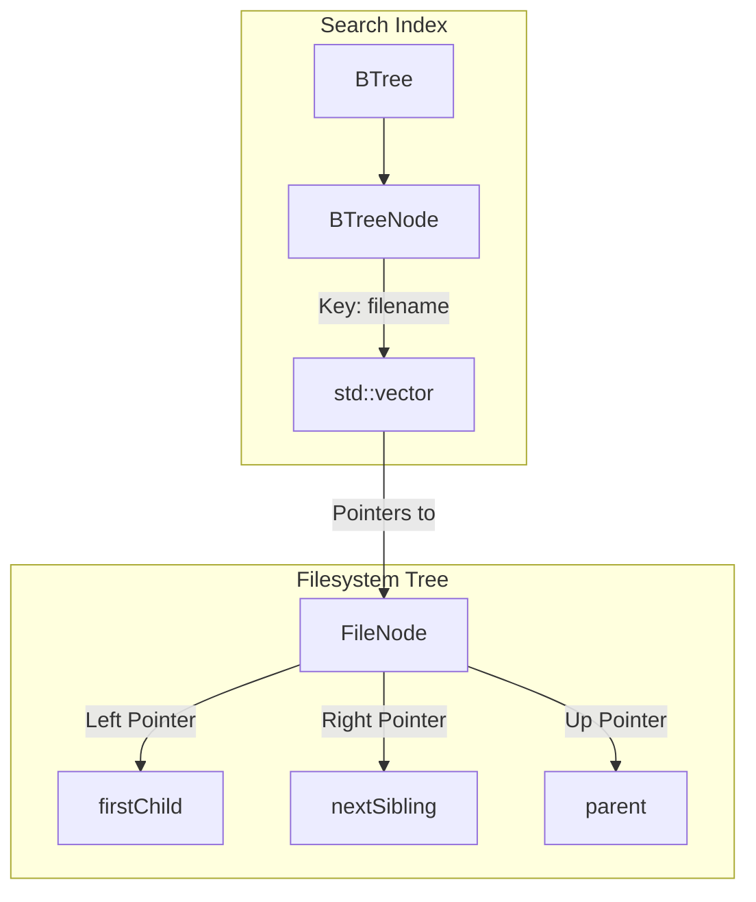

# Project Documentation: Interactive TUI File System Explorer

This documentation provides a comprehensive overview of the **Interactive TUI File System Explorer**, detailing its functionality, core data structure designs (Left-Child Right-Sibling Binary Tree & Custom B-Tree index), and how to compile and run the application.

---

## 1. Executive Summary: What the Application Does

The **Interactive TUI File System Explorer** is an educational, memory-managed Text User Interface (TUI) console application written in C++ that simulates a hierarchical file system in memory. It provides users with a visual, responsive interface resembling classic terminal file managers (such as Midnight Commander or Ranger).

Key features and user-facing capabilities include:
* **Interactive Directory Navigation**: Users can scroll through files and directories using the arrow keys, descend into subfolders by pressing `Enter`, and climb back up to parent directories by selecting `..` or pressing `Backspace`/`Left Arrow`.
* **Dynamic File & Directory Creation**: Directories can be created instantly using the `m` shortcut (simulating `mkdir`), and files can be created using `t` (simulating `touch`). The file list is updated in real-time and kept sorted alphabetically.
* **Dual-Pane TUI Layout**: 
  * **Left Pane (Tree View)**: Recursively displays a visual ASCII directory tree starting from the current directory, showing the nested folder structure.
  * **Right Pane (File List)**: Shows the immediate contents of the current directory with active cursor highlighting.
* **Instant B-Tree Searching**: Users can search for any file or directory name instantly using the `/` or `s` key. Because files can exist with identical names in different directories, the search indexes all matching instances and displays their absolute paths.
* **Interactive Jump Navigation**: Hitting `Enter` on any search result instantly changes the working directory to the target item's parent directory and highlights the matching item in the list.

---

## 2. Technical Architecture & Data Structures

To avoid built-in collection classes (such as keeping a `std::vector` of children inside a directory node), the application uses custom data structures designed to satisfy specific educational constraints.



### A. Left-Child Right-Sibling (LCRS) Binary Tree (`FileNode.h`)
In a typical filesystem, a directory can have an arbitrary (N-ary) number of child files and folders. In this application, this multi-way tree structure is mapped 1-to-1 onto a **Binary Tree** using the Left-Child Right-Sibling representation:
* **`firstChild` (Left pointer)**: Points to the first child node inside a directory.
* **`nextSibling` (Right pointer)**: Points to the next sibling node at the same directory level.
* **`parent`**: Points to the parent directory node, enabling fast upward climbing (for `cd ..` and absolute path reconstruction).

#### Memory Ownership & Destruction
Memory management is handled deterministically via RAII (Resource Acquisition Is Initialization). In `FileNode`'s destructor:
```cpp
~FileNode() {
    delete firstChild;
    delete nextSibling;
}
```
* Deleting `firstChild` recursively deletes all descendants.
* Deleting `nextSibling` recursively deletes all subsequent siblings.
* Consequently, calling `delete root` on shutdown triggers a cascading cleanup that safely deallocates the entire filesystem tree without memory leaks.

### B. Custom Self-Balancing B-Tree Index (`BTree.h`, `BTree.cpp`)
To search for files without performing an expensive $O(N)$ linear scan of the entire directory tree, the system maintains a custom **B-Tree index** of minimum degree $t$ ($t=3$ by default).
* **Multi-Value Support**: Each B-Tree key represents a filename (`std::string`), which maps to a value vector (`std::vector<FileNode*>`). This allows multiple files with identical names (e.g., `resume.pdf` in different folders) to be indexed under the same key.
* **Search Complexity**: Searching runs in $O(\log n)$ time, traversing from the B-Tree root down to the target leaf node.
* **Preemptive Node Splitting**: During insertions, if a node is found to be full (containing $2t - 1$ keys), it is immediately split before traversing deeper. This ensures that insert operations are completed in a single pass down the tree, maintaining $O(\log n)$ insertion complexity.

### C. POSIX Terminal Raw Mode (`main.cpp`)
The interactive TUI requires capturing keystrokes instantly without waiting for a newline (standard line-buffering) and hiding input echo.
* **Termios Configurations**: The application modifies terminal flags using `<termios.h>` to clear `ICANON` and `ECHO`.
* **ANSI Escape Parsing**: Arrow keys send 3-byte escape sequences (e.g. `\033[A` for Up). A short-timeout `select()` read parses these sequences.
* **Signal Safety**: A global pointer registers the active `TerminalRawMode` instance. Signal handlers for `SIGINT` (Ctrl+C) and `SIGTERM` ensure that if the app is abruptly closed, the terminal is restored to its default state.

---

## 3. Compilation and Execution

The project provides a `Makefile` to compile the C++ source files using `g++` under Linux/macOS.

### Prerequisites
* A C++ compiler supporting C++17 (e.g., GCC 7+ or Clang).
* GNU Make.

### Building the Project
Navigate to the project root directory and run:
```bash
make
```
This compiles `BTree.cpp`, `FileSystem.cpp`, and `main.cpp`, linking them into the `fs_explorer` executable.

### Running the Application
Launch the explorer using:
```bash
./fs_explorer
```

### Cleaning Up Build Files
To remove intermediate object files (`.o`) and the executable:
```bash
make clean
```

---

## 4. Key Binding Reference

| Key | Context | Description |
| :--- | :--- | :--- |
| **`[↑ / ↓]`** | Browser / Search Results | Moves the selection highlight bar up or down. |
| **`[Enter]`** | Browser | Opens the selected directory (or parent folder if `..` is selected). |
| **`[Enter]`** | Search Results | Jumps directly to the selected file's location in the filesystem. |
| **`[Backspace / Left Arrow]`** | Browser | Navigates back up to the parent directory. |
| **`[m]`** | Browser | Prompts to create a new directory inside the current directory. |
| **`[t]`** | Browser | Prompts to create a new empty file inside the current directory. |
| **`[s] or [/]`** | Browser | Opens the search query input bar. |
| **`[Esc]`** | Inputs / Search Results | Cancels the active prompt or result overlay, returning to browsing. |
| **`[q] or [Esc]`** | Browser | Cleans up memory and exits the program. |
