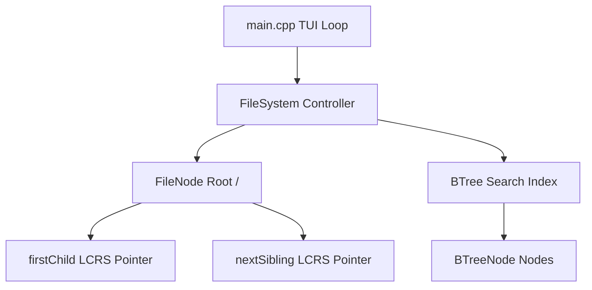

# Interactive TUI File System Explorer in C++

An educational, memory-managed interactive Text User Interface (TUI) application that simulates a hierarchical file system in C++. The project showcases custom data structures and algorithm designs, specifically mapping an arbitrary multi-way (N-ary) directory tree onto a **Left-Child Right-Sibling (LCRS) Binary Tree**, combined with a custom **B-Tree index** for instant $O(\log n)$ file searching.

---

## 🚀 Key Features

* 📁 **Dual-Pane TUI Layout**: Renders an interactive sidebar showing the directory tree (left pane) and a scrollable list of the current directory contents (right pane).
* 🌳 **Left-Child Right-Sibling (LCRS) Representation**: Employs a custom binary tree structure to represent arbitrary parent-child structures (directories containing an infinite number of subdirectories/files) without using standard collection types (e.g., `std::vector` or `std::list` for child tracking inside nodes).
* 🔍 **High-Performance B-Tree Search Index**: Employs a custom, self-balancing B-Tree index to map file names to their corresponding `FileNode` instances, enabling search operations across the entire virtual drive in $O(\log n)$ time.
* 🔗 **Support for Duplicate Filenames**: The B-Tree keys map to list vectors (`std::vector<FileNode*>`) to support indexing multiple files with the same name located in different directories.
* 🛠️ **Path Resolution System**: Supports both relative paths (e.g., `.` , `..`, `dir1/../dir2`) and absolute paths (e.g., `/dir1/file.txt`).
* 🎨 **Interactive Premium TUI Console**: Features gray tree borders, blue directories, and green files, with active highlight select scroll bar and bottom legendary control bindings.

---

## 🛠️ Architecture & Design

The project is structured into three main components: the node definition, the self-balancing index, and the file system controller.



### 1. File Node Hierarchy (`FileNode.h`)
Represents an individual node in the file system tree. A node can either be a `FILE` or a `DIRECTORY`.
* **LCRS Representation**: To represent an N-ary tree using a binary tree:
  * `firstChild` points to the directory's first child node.
  * `nextSibling` points to the next sibling node at the same directory level.
* **Parent Pointers**: Every node retains a pointer to its `parent`, simplifying upward path traversals (like resolving `..` in directory navigation).
* **Deterministic Memory Management**: The destructor recursively deallocates both `firstChild` and `nextSibling` nodes, meaning deleting the root recursively cleans up the entire memory space of the file system.

### 2. Custom B-Tree Search Index (`BTree.h`, `BTree.cpp`)
A self-balancing search tree designed to store sorted data and allow search, insert, and split operations.
* **Degree $t$**: Instantiated with a minimum degree of $t$ ($t=3$ by default). A node contains up to $2t - 1$ keys and up to $2t$ child pointers.
* **One-Pass Insertions**: Full nodes are split preemptively while traversing down the tree, eliminating the need to backtrack up the tree when inserting a new key.
* **Multi-Value Indexing**: Maps each key (filename string) to a list of matching `FileNode` pointers, allowing duplicate filenames in different directories to be tracked and searched.

### 3. File System Controller (`FileSystem.h`, `FileSystem.cpp`)
Maintains the root directory node (`/`), tracks the current working directory (`currentDir`), and mediates between user commands and the internal data structures.
* **Alphabetically Sorted Directory Listings**: When creating new folders/files, `insertChildSorted` performs a sorted linear insertion into the LCRS sibling chain. This guarantees that `ls` prints contents alphabetically without needing sorting operations on demand.
* **Hierarchical Tree Visualizer**: Utilizes recursive DFS (`printTreeHelper`) to print tree structures using standard Unicode box-drawing characters (`├─`, `└─`, `│`).

---

## 🎮 TUI Key Controls

The TUI browser supports the following interactive control bindings:

| Key Binding | Action | Description | Complexity |
| :--- | :--- | :--- | :--- |
| `[↑ / ↓]` | Navigate selection | Scrolls the active selection bar up or down in the current pane. | $O(1)$ |
| `[Enter]` | Open / Confirm | Enters the selected directory, jumps to a search result, or confirms an input. | $O(d \cdot c)$ |
| `[Left / Backspace]` | Back / Up | Navigates back up to the parent directory (`cd ..`). | $O(d \cdot c)$ |
| `[m]` | Make Directory | Prompts to create a new subdirectory at the current path. | $O(d \cdot c)$ |
| `[t]` | Touch File | Prompts to create a new empty file at the current path. | $O(d \cdot c)$ |
| `[s] or [/]` | Search | Opens the search bar to query the B-Tree index across all directories. | $O(\log n)$ |
| `[q] or [Esc]` | Quit / Back | Quits the program (or returns to normal browsing from search results/inputs). | $O(N)$ |

*Note on complexities:*
* $n$ = total number of files/directories in the entire file system.
* $N$ = total number of files/directories in the current directory's subtree.
* $d$ = depth of the target path (number of directory levels).
* $c$ = number of children/siblings in the target directories.

---

## 🛠️ Build and Compilation

A `Makefile` is included to simplify compilation. Ensure you have `g++` and `make` installed.

### Build Executable
To compile and build the `fs_explorer` executable:
```bash
make
```

### Clean Build Artifacts
To remove compiled object files and clean up the directory:
```bash
make clean
```

### Running the App
Once compiled, launch the interactive explorer:
```bash
./fs_explorer
```

---

## 💡 Code Design & Highlights

### Left-Child Right-Sibling (LCRS) Mapping Example
A standard directory structure:
```text
/ (root)
├── documents/
│   ├── notes.txt
│   └── resume.pdf
└── photos/
```
Is mapped internally in memory as a binary tree:
```text
/ (root)
  └── [firstChild] ──> documents
                          ├── [firstChild] ──> notes.txt
                          │                      └── [nextSibling] ──> resume.pdf
                          └── [nextSibling] ──> photos
```
This elegant layout conforms to the strict binary tree pointer structure while allowing directories to contain an infinite number of files and folders.
